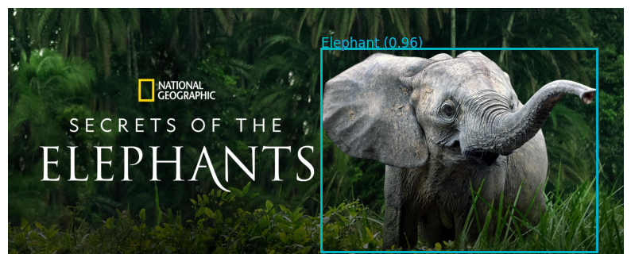

# Multimodal Image Analysis for Scene Understanding And Photo Captioning

** This project was undertaken as a challenge aimed at securing a position as a deep learning research assistant. The task involved leveraging existing models within a tight timeframe, focusing on strategic problem-solving approaches rather than assessing ML expertise, highlighting our ability to tackle real-world challenges effectively **

## Project Description

The **Multimodal Image Analysis for Scene Understanding** project aims to harness the power of cutting-edge APIs to achieve a comprehensive understanding of visual content within images. By combining multiple data analysis techniques, including object detection, face and emotion detection, landmark detection, logo detection, and optical character recognition (OCR), this project aims to provide a holistic interpretation of scenes captured in images.

## Strategy

### Object Detection
We utilize advanced object detection APIs to identify and categorize objects present in the image. This process provides insights into the key elements that contribute to the composition of the scene.

### Face and Emotion Detection
We employ facial recognition APIs to detect and analyze faces in the image. This includes extracting attributes such as emotion and age, enhancing the understanding of human presence and sentiment.

### Landmark Detection
By applying landmark detection APIs, we identify significant points within the image, such as architectural features. This process contributes to a deeper understanding of spatial context.

### Logo Detection
We implement logo detection APIs to recognize corporate logos within the image. This adds contextual information and potential insights into brand associations.

### Optical Character Recognition (OCR)
We leverage OCR APIs to extract text from the image. This allows us to incorporate textual information that may be crucial for a comprehensive scene interpretation.

## Integration and Narrative Generation

The outcomes of these multimodal analyses are combined to create a cohesive and comprehensive representation of the scene. The aggregated information serves as input to OpenAI's advanced language model. This model generates a descriptive narrative that encapsulates the detected elements, their interactions, and the dynamics of the overall scene. By adopting a multimodal approach, this project aims to offer a richer and more nuanced understanding of visual content, potentially revolutionizing how complex scenes are perceived and described.

## Conclusion

The **Multimodal Image Analysis for Scene Understanding** project represents a fusion of modern data analysis techniques and advanced language generation models. This combination is poised to redefine how we interpret and describe intricate visual scenes, opening up new possibilities for applications in various domains such as image analysis, content generation, and scene comprehension.
